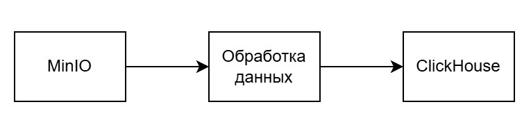
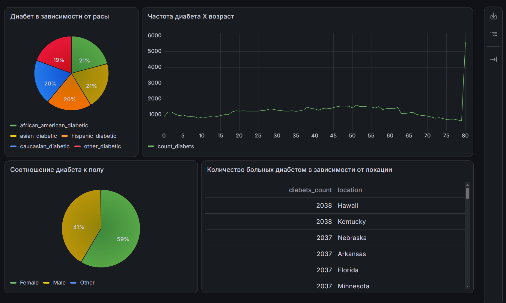

# ETL_process

## Проект реализует цикл ETL:
1. Извлекает данные из MinIO
2. Обрабатывает данные с помощью алгоритма:
    * Вычисляет пороговые значения для числовых данных
    * Определяет возможные выбросы в строковых данных
    * Очищает датасет от дубликатов строк
    * Приводит в норму (путем вычисления среднего значения) аномальные числовые значения
    * Заполняет пропуски числовых значений средним
    * Выявляет аномальные даты, заменяет их на None
3. Загружает обработанный датасет в ClickHouse


## Архитектура:

1. **MinIO:** Объектное хранилище для сбора сырых файлов
2. **PySpark:** Фреймворк для распределенной обработки и анализа больших данных с использованием Python API
3. **ClickHouse:** Колоночная OLAP-СУБД
4. **Grafana:** Платформа для визуализации данных

---

## Технологический стек
* **Язык разработки:** Python
* **Инфраструктура:** Docker, Docker Compose
* **Хранение и СУБД:** MinIO, ClickHouse
* **Визуализация:** Grafana

---
## Обработка датасета Comprehensive Diabetes Clinical Dataset (100000)

**Информация по колонкам:**
| year | gender | age | location | race_AfricanAmerican | race_Asian | race_Caucasian | race_Hispanic | race_Other | hypertension | heart_disease | smoking_history | bmi | hbA1c_level | blood_glucose_level | diabetes |
| :--- | :--- | :--- | :--- | :---: | :---: | :---: | :---: | :---: | :---: | :---: | :--- | ---: | ---: | ---: | ---: |
| 2015 | Female | 80.0 | Alabama | 0 | 1 | 0 | 0 | 0 | 0 | 1 | No Info | 16.97 | 6.5 | 126 | 0 |
| 2016 | Male | NULL | Alabama | 0 | 0 | 1 | 0 | 0 | 0 | 0 | No Info | 22.13 | 6.2 | 200 | 0 |
| 2015 | Female | NULL | Alabama | 1 | 0 | 0 | 0 | 0 | 0 | 0 | No Info | 18.39 | 3.5 | 80 | 0 |

**Анализ типов данных**
| Название колонки | Тип |
| :--- | :--- |
| year | int |
| gender | string |
| age | double |
| location | string |
| race_AfricanAmerican | int |
| race_Asian | int |
| race_Caucasian | int |
| race_Hispanic | int |
| race_Other | int |
| hypertension | int |
| heart_disease | int |
| smoking_history | string |
| bmi | double |
| hbA1c_level | double |
| blood_glucose_level | int |
| diabetes | int |

**Количество пропусков (пропусков нет)**
| Название колонки| Пропуски до | Пропуски после |
| :--- | :---: | :---: |
| year | 0 | 0 |
| gender | 0 | 0 |
| age | 0 | 0 |
| location | 0 | 0 |
| race_AfricanAmerican | 0 | 0 |
| race_Asian | 0 | 0 |
| race_Caucasian | 0 | 0 |
| race_Hispanic | 0 | 0 |
| race_Other | 0 | 0 |
| hypertension | 0 | 0 |
| heart_disease | 0 | 0 |
| smoking_history | 0 | 0 |
| bmi | 0 | 0 |
| hbA1c_level | 0 | 0 |
| blood_glucose_level | 0 | 0 |
| diabetes | 0 | 0 |

**Аномальных значение в числовых и строковых данных не обнаружено**

- Размер датасета до очистки: 100000
- Размер датасета после очистки: 99986

Удалены дубликаты строк

---
## Результат визуализации (Дашборд в Grafana)



*Ссылка на датасет: https://www.kaggle.com/datasets/priyamchoksi/100000-diabetes-clinical-dataset*

---

## Как запустить проект локально

### 1. Подготовка окружения
- Клонируйте репозиторий и поднимите инфраструктуру в Docker:
```bash
git clone [https://github.com/Waysyy/ETL_process.git](https://github.com/Waysyy/ETL_process.git)
cd ETL_process
docker-compose up -d
```
- Скачайте датасет в формате *.csv* и загрузите его в MinIO или папку *raw_csv* в корне проекта.

- Создайте необходимую таблицу в ClickHouse (скрипт для создания таблицы из примера находится в *scr\SQL_scripts*)

- Перед запуском установите необходимое название базы данных
```Python
.option("dbtable", "название") \
```
### 2. Запуск
Для выполнения пайплана запустите файл *data_processing.py*

```bash
python scr/data_processing/data_processing.py
```